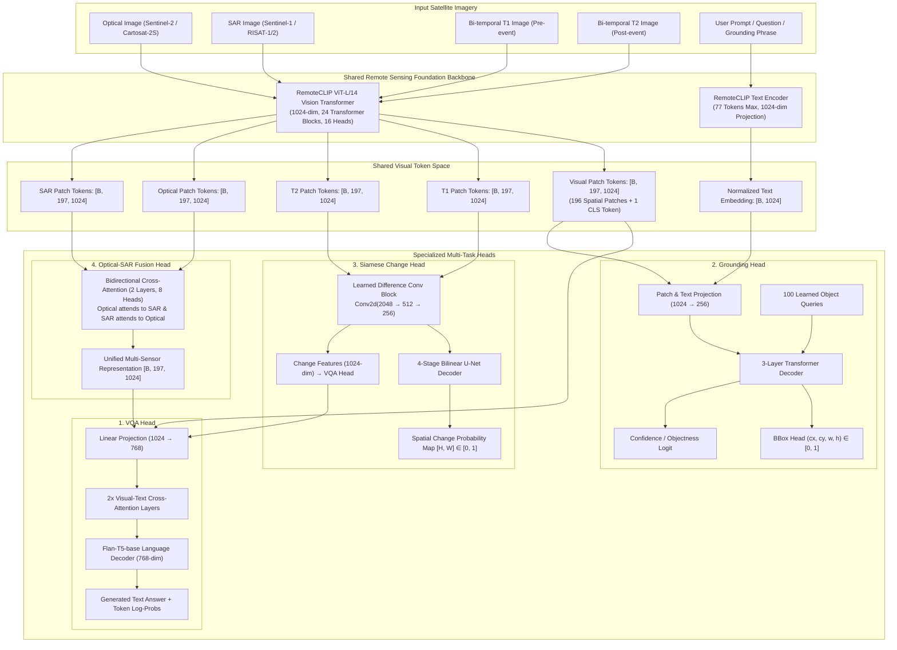
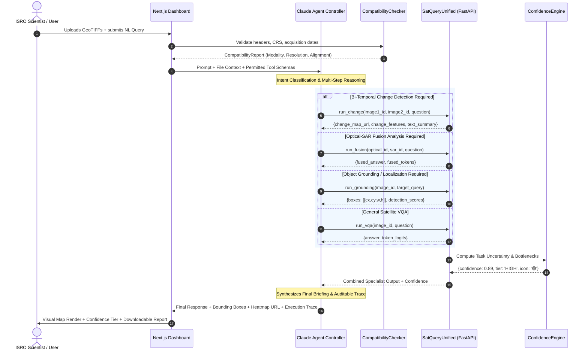
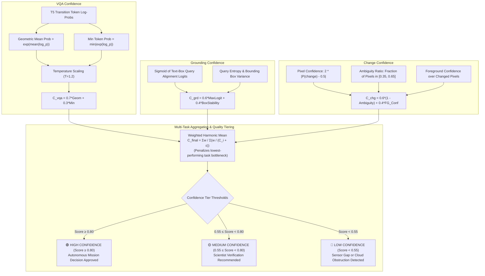

# SatQuery AI — Architecture Blueprints & Diagrams
**SIH26167 | ISRO Space Technology Problem Statement**
**System: Multimodal Remote Sensing VLM with Agentic Orchestrator & Sensor Adaptation**

---

## 1. High-Level System Architecture

The end-to-end system separates the **User Presentation Layer**, the **Agentic Orchestrator (Claude 3.5 Sonnet)**, the **FastAPI Inference Gateway**, and the **Core Deep Learning Vision-Language Model (`SatQueryUnified`)**.

```mermaid
graph TB
    subgraph Client ["Client Layer (Web Application)"]
        UI["Next.js 14 Dashboard"]
        MAP["Leaflet / OpenLayers Geospatial Canvas"]
        CHAT["Conversational & Trace Feed"]
        PDF_BTN["ISRO Report Generator (.pdf)"]
    end

    subgraph Orchestration ["Agentic Controller Layer (Autonomous Reasoning)"]
        AGENT["Claude 3.5 Sonnet Agentic Controller"]
        MEM["Conversation Context & Execution Trace"]
        TOOL_REG["Validated Tool Registry<br/>(run_vqa, run_grounding, run_change, run_fusion)"]
    end

    subgraph Gateway ["API & Processing Gateway (FastAPI)"]
        ROUTER["FastAPI Router & Schema Validator"]
        PREPROC["Sensor Normalizer & GeoTIFF Handler"]
        CONF_ENG["Unified Confidence Engine"]
        AUDIT["Auditable Execution Logger"]
    end

    subgraph DeepLearning ["Core Perception Engine (PyTorch / CUDA)"]
        BACKBONE["RemoteCLIP ViT-L/14 Backbone<br/>(Pretrained on 5M Remote Sensing Pairs)"]
        HEAD_VQA["VQA Head<br/>(Flan-T5-base Decoder + Cross-Attention)"]
        HEAD_GRD["Grounding Head<br/>(100 Learned DETR Object Queries)"]
        HEAD_CHG["Change Head<br/>(Siamese Diff + U-Net Spatial Decoder)"]
        HEAD_FUS["Fusion Head<br/>(Optical ↔ SAR Bidirectional Attention)"]
    end

    subgraph DataStorage ["Data & File Storage"]
        TIFF_STORE["Raw Multi-Spectral & SAR GeoTIFF Store"]
        CKPT_STORE["Model Checkpoints (/checkpoints)"]
        REPORT_STORE["Exported Mission Reports (.pdf)"]
    end

    UI <--> |REST / SSE Stream| ROUTER
    MAP <--> |GeoJSON / Heatmap Overlays| ROUTER
    CHAT <--> |Natural Language Queries| AGENT
    AGENT <--> |Tool Invocations & Parameters| ROUTER
    AGENT --- MEM
    AGENT --- TOOL_REG

    ROUTER --> PREPROC
    PREPROC --> |Harmonized [3, 224, 224] Tensors| BACKBONE
    BACKBONE --> |1024-d Visual Tokens [B, 197, 1024]| HEAD_VQA
    BACKBONE --> |Patch Tokens + Text Embeddings| HEAD_GRD
    BACKBONE --> |Bi-temporal Token Pairs (f1, f2)| HEAD_CHG
    BACKBONE --> |Optical + SAR Token Pairs| HEAD_FUS

    HEAD_VQA --> CONF_ENG
    HEAD_GRD --> CONF_ENG
    HEAD_CHG --> CONF_ENG
    HEAD_FUS --> CONF_ENG

    CONF_ENG --> ROUTER
    ROUTER --> AUDIT
    AUDIT --> CHAT
    PREPROC --- TIFF_STORE
    BACKBONE --- CKPT_STORE
    ROUTER --> PDF_BTN
    PDF_BTN --- REPORT_STORE
```

---

## 2. SatQueryUnified Model Architecture

The deep learning model `SatQueryUnified` processes heterogeneous satellite modalities through a shared, high-capacity vision foundation model and routes specialized task features to four dedicated heads.



---

## 3. 5-Stage Cross-Sensor Domain Normalization Pipeline

This pipeline bridges the domain gap between Sentinel training distributions and evaluation satellites (Cartosat-2S and RISAT-1/2).

```mermaid
flowchart LR
    RAW["Raw Input Raster<br/>(GeoTIFF, TIFF, PNG, JPEG)"]

    subgraph S1 ["Stage 1: Channel Harmonization"]
        CH_OPT["Optical: Extract / Map to [B, G, R, NIR]<br/>Cartosat-2S HRMX (4-Band) ↔ Sentinel-2 (B2, B3, B4, B8)"]
        CH_SAR["SAR: Map to [Co-Pol, Cross-Pol]<br/>RISAT Hybrid Pol (Stokes S0..S3) → Pseudo VV/VH"]
    end

    subgraph S2 ["Stage 2: Radiometric Calibration"]
        RC_OPT["Dark Object Subtraction (DOS)<br/>11-bit DN → Surface Reflectance (BOA) ∈ [0, 1]"]
        RC_SAR["Radiometric Calibration to Sigma0 (dB)<br/>Apply Refined Lee 5x5 Adaptive Speckle Filter"]
    end

    subgraph S3 ["Stage 3: Spatial Scale Alignment"]
        DOWN["Anti-Aliasing Gaussian Downsampling (σ=1.5)<br/>Align Sub-Meter (0.65m-2m) to Baseline 10m GSD"]
    end

    subgraph S4 ["Stage 4: Statistical & Fourier Adaptation"]
        HIST["CDF Histogram Matching against Sentinel Reference"]
        FDA["Fourier Domain Adaptation (FDA, β=0.05)<br/>Swap Low-Frequency Amplitude Spectrum"]
        CLIP["Robust Percentile Clipping [P1, P99]"]
    end

    subgraph S5 ["Stage 5: Test-Time Augmentation (TTA)"]
        TTA_ROT["Multi-Scale / Flips / 90° Rotations"]
        NORM["Standardize to [3, 224, 224] Float32 Tensor"]
    end

    RAW --> S1
    S1 --> S2
    S2 --> S3
    S3 --> S4
    S4 --> S5
    S5 --> MODEL["Fed to SatQueryUnified Backbone"]
```



---

## 4. Agentic Decision & Tool-Routing Workflow

The Agentic Controller runs in a closed loop, inspecting input metadata, query intent, and tool outcomes.



---

## 5. Unified Confidence Estimation Topology

Confidence is calibrated across all four modalities before being aggregated into a single verifiable metric.


